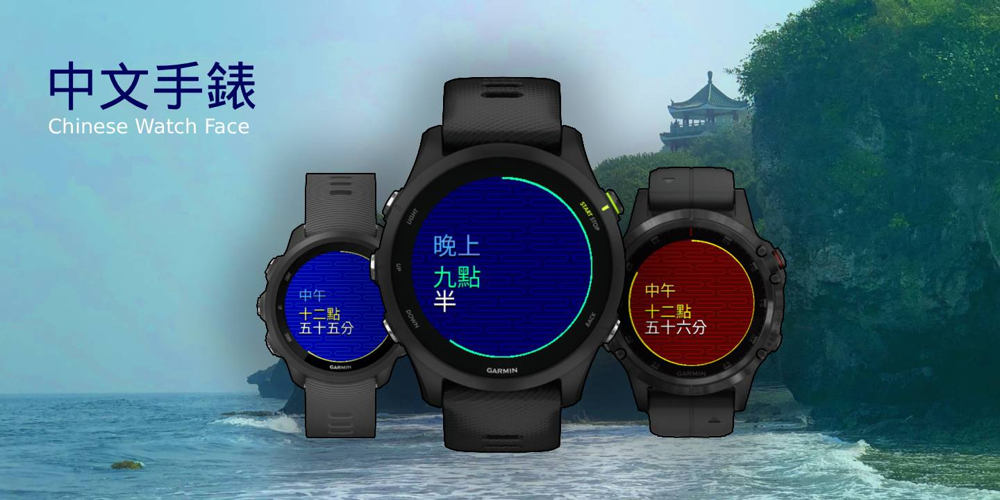

# Garmin Chinese Watch Face

Available on Garmin ConnectIQ soon!

View the time in Chinese! Great for students! 

Watch displays:
- the time of day in Chinese
- the hour and minute in Chinese
- a second hand
- and a decorative wave background.

Choose from a list of themes including:
- Waves
- Sky
- Chinese New Year
- and more!

NOTE: This watch face does NOT require a APAC/Taiwan/China/HK model to be able to display Chinese.

## About

This is a branch of [garmin-mandarin-clock](https://github.com/starryalley/garmin-mandarin-clock) by [Mark Kuo](https://github.com/starryalley).
I love using this watch face, and wanted to give it a little decoration and some motion.
Inspired by how dive watches often have wave backgrounds, 
I added a wave background meant to resemble the way clouds are often drawn in Asia.
I've also added a second hand to make the watch feel more alive.

